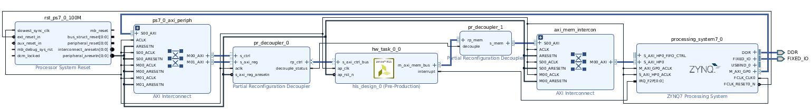

# FRED Static Part

This repo contains an example design of the static part of the FRED design, considering a single reconfigurable region. The design is fully automated with TCL scripts so you dont need to save the entire Vivado design.
The project is setup for PYNQ board, although it would be easy to change to other boards assuming you have some basic TCL skills.

# FRED static part

This is a image of the block design of the FRED static part.

# How to run it

These scripts are assuming Linux operation system (Ubuntu 18.04) and Vivado 2019.2.

Follow these instructions to recreate the Vivado and SDK projects:
 - Open the **build.sh** script and edit the first lines to setup these environment variables:
    - **VIVADO**: path to the Vivado install dir;
    - **VIVADO_DESIGN_NAME**: mandatory name of the design;
    - **XIL_APP_NAME**: used only in projects with software;
    - **VIVADO_TOP_NAME**: set the top name (optional).  
 - run *build.sh*

These scripts will recreate the entire Vivado project, compile the design, generate the bitstream, update the bitstream with the elf file, export the hardware to SDK, create the SDK projects, import the source files, build all projects, and finally download both the bitstream and the elf application. Hopefully, all these steps will be executed automatically.

This design generates the bitstream of FRED static part and three report files called: *power.rpt*, *timing.rpt*, and *utilization.rpt*.

# Authors

- Alexandre Amory (March 2021), ReTiS Lab, Scuola Sant'Anna, Pisa, Italy.

# Credits

This benchmark is an extension of PolyBench benchmark provided by Björn Forsberg, used in this paper presented below. Bjorn's extension included OpenMP pragmas for GPU offloading. 

- Forsberg, Björn, Luca Benini, and Andrea Marongiu. "Heprem: A predictable execution model for gpu-based heterogeneous socs." IEEE Transactions on Computers 70.1 (2020): 17-29.

These Vivado scripts are based on the excellent scripts from [fpgadesigner](https://github.com/fpgadeveloper/zedboard-axi-dma) plus few increments from my own such as project generalization, support to SDK project creation and compilation and other minor improvements. 

Please refer to the original [Vivado template](https://github.com/amamory/vivado-base-project) for more information or to start a new project with this similar structure. 

# How to Use Vivado

[Vipin Kizheppatt](https://www.youtube.com/watch?v=ahws--oNpBc&list=PLXHMvqUANAFOviU0J8HSp0E91lLJInzX1) provides a great set of more than 70 extremely didatic videos. As a personal experience, I would strongly suggest that as a starting point.

# Funding

This tool has been developed in the context of the [AMPERE project](https://ampere-euproject.eu/).
This project has received funding from the European Union’s Horizon 2020 
research and innovation programme under grant agreement No 871669.
