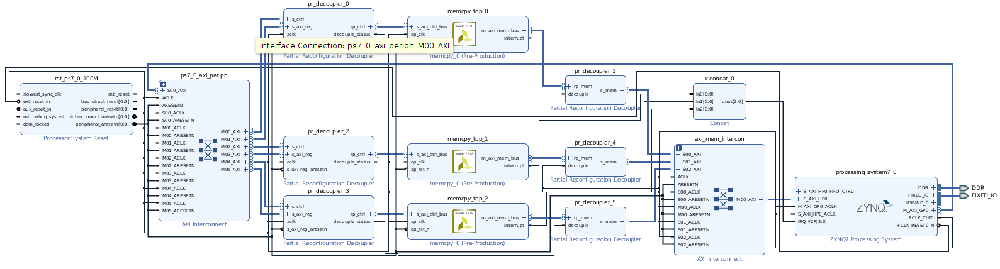

# FRED Static Part (TO BE DONE !!!!)

This repo contains an example design of the static part of the FRED design, considering a **three reconfigurable regions**. The design is fully automated with TCL scripts so you dont need to save the entire Vivado design.
The project is setup for PYNQ board, although it would be easy to change to other boards assuming you have some basic TCL skills.

# FRED static part

This is an image of the block design of the FRED static part.

# How to run it

These scripts are assuming Linux operation system (Ubuntu 18.04) and Vivado 2019.2.

Follow these instructions to recreate the Vivado and SDK projects:
 - Open the **build.sh** script and edit the first lines to setup these environment variables:
    - **VIVADO_DESIGN_NAME**: mandatory name of the design;
    - **VIVADO_TOP_NAME**: set the top name (optional);
    - **VIVADO_SYN_STEP**: the DART compatible boards: pynq or zynq.
 - run *build.sh*

These scripts will recreate the entire Vivado project and synthesize the design.

This design generates the bitstream of FRED static part and three report files called: *power.rpt*, *timing.rpt*, and *utilization.rpt*.

# Authors

- Alexandre Amory (April 2021), ReTiS Lab, Scuola Sant'Anna, Pisa, Italy.

# Credits

Please refer to the original [Vivado template](https://github.com/amamory/vivado-base-project) for more information or to start a new project with this similar structure. 

# How to Use Vivado

[Vipin Kizheppatt](https://www.youtube.com/watch?v=ahws--oNpBc&list=PLXHMvqUANAFOviU0J8HSp0E91lLJInzX1) provides a great set of more than 70 extremely didatic videos. As a personal experience, I would strongly suggest that as a starting point.

# Funding

This tool has been developed in the context of the [AMPERE project](https://ampere-euproject.eu/).
This project has received funding from the European Union’s Horizon 2020 
research and innovation programme under grant agreement No 871669.
